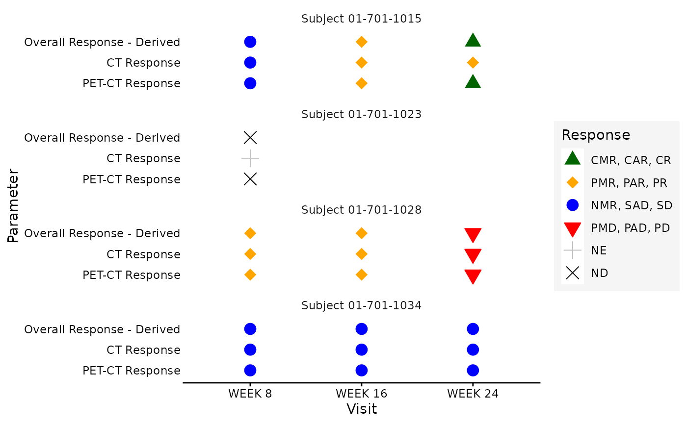
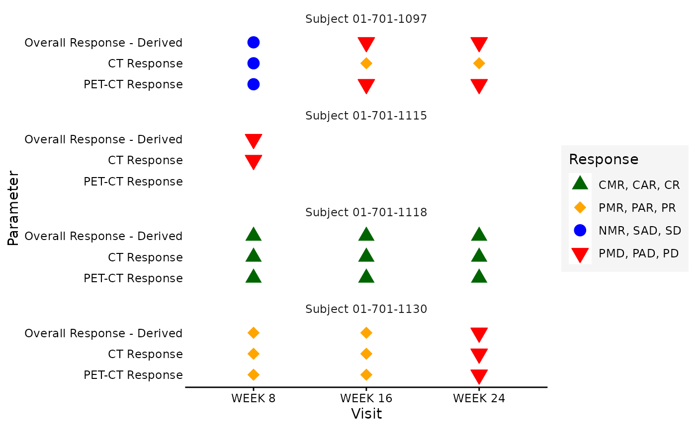
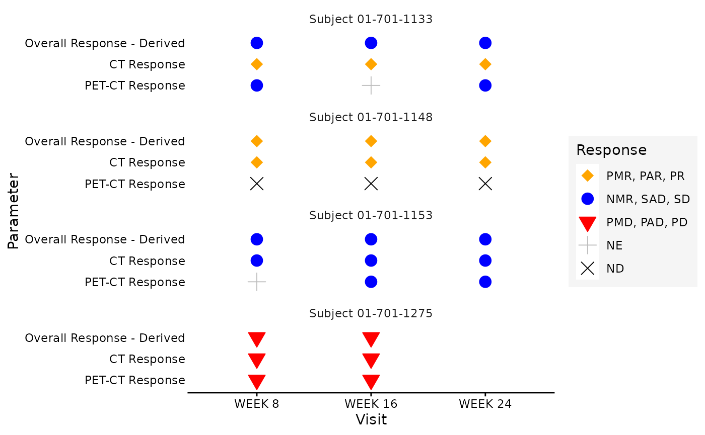
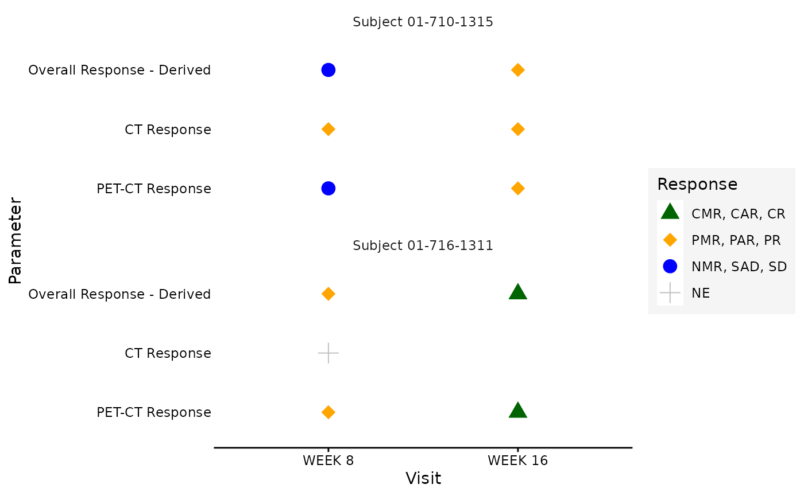

# Creating ADRS with Lugano 2014 Criteria

## Introduction

This article describes creating an `ADRS` ADaM dataset for lymphoma
studies based on the [**Lugano 2014 response
criteria**](https://doi.org/10.1200/JCO.2013.54.8800).

Lymphoma response assessment under Lugano 2014 is based on a combination
of imaging-based evaluations:

- **PET-CT based assessment**, providing metabolic response evaluation
  using the 5-point Deauville scale.
- **CT-based assessment**, providing anatomic response evaluation of
  nodal and extranodal disease.

Depending on the study and the disease subtype, response evaluation may
use PET-CT as the primary modality (for FDG-avid lymphomas) or CT alone
(for non–FDG-avid lymphomas). Some studies collect both PET-CT and CT
response components, and a combined overall response is derived.

Please check [Lugano 2014
Classification](https://imagingendpoints.com/wp-content/uploads/2022/07/IEP-6936-Lugano-at-IE-2022-FV1.0_DIGITAL_Final-25-07-22.pdf)
for more details.

**Note:** In many Lugano 2014 studies, the overall timepoint response
may be collected directly from the investigator or independent review
committee. In such cases, the collected overall response should
generally be used according to the study protocol and statistical
analysis plan, and the derivation shown below may not be needed.

The derivation below is provided only as an example of how an integrated
timepoint response could be derived when the combined overall response
is **not collected directly**. It is not intended as general Lugano 2014
implementation guidance. Study-specific rules may vary and should be
aligned with the protocol, SAP, CRF design, and data review conventions.

For extended guidance on common steps in `ADRS` creation and additional
response endpoints, refer to the examples in [Creating ADRS (Including
Non-standard
Endpoints)](https:/pharmaverse.github.io/admiralonco/357_release_1_5/articles/adrs.md).

## Lugano 2014 Response Categories for Lymphoma

The Lugano 2014 response criteria define lymphoma response using PET-CT
based metabolic assessment and CT-based anatomic assessment.

The following tables summarize the response categories used in this
vignette for PET-CT and CT assessments. These summaries are intended to
support the example derivations and should be aligned with the study
protocol and statistical analysis plan.

### PET-CT Based Response Categories

| Table 1: PET-CT Based Response Categories             |                                                             |
|-------------------------------------------------------|-------------------------------------------------------------|
| Lugano 2014 response categories used in this vignette |                                                             |
| PET-CT Response                                       | Description                                                 |
| CMR                                                   | Complete metabolic response                                 |
| PMR                                                   | Partial metabolic response                                  |
| NMR or SMD                                            | No metabolic response or stable metabolic disease           |
| PMD                                                   | Progressive metabolic disease                               |
| NE                                                    | Not evaluable                                               |
| ND                                                    | Not done or not determined                                  |
| NED                                                   | No evidence of FDG-avid disease, generally BICR or IRC only |
| PSP                                                   | Pseudoprogression                                           |

### CT-Based Response Categories

| Table 2: CT-Based Response Categories              |                              |
|----------------------------------------------------|------------------------------|
| Anatomic response categories used in this vignette |                              |
| CT Response                                        | Description                  |
| CAR                                                | Complete anatomic response   |
| PAR                                                | Partial anatomic response    |
| SAD                                                | Stable anatomic disease      |
| PAD                                                | Progressive anatomic disease |
| NE                                                 | Not evaluable                |
| ND                                                 | Not done or not determined   |
| NED                                                | No evidence of disease       |

In this example data, `NMR` is used for no metabolic response. Some
implementations may use `SMD` for stable metabolic disease. For the
purpose of the combined overall response derivation in this vignette,
both `NMR` and `SMD` map to `SD`.

Values such as `NED`, `PSP`, `NE`, and `ND` require study-specific
handling. For example, `NED` by PET-CT is generally expected only from a
blinded independent central review (BICR) or independent review
committee (IRC) and may indicate that no FDG-avid disease was identified
at baseline. In that case, the integrated timepoint response often
defaults to the CT response if one is available.

## Programming Workflow

- [Read in Data](#readdata)
- [Pre-processing of Input Records](#input)
- [Derive PET-CT and CT Response Parameters](#param)
- [Derive Combined Overall Timepoint Response (`OVRLRESC`)](#ovrlresc)
- [Other Endpoints](#other)

### Required Packages

The examples of this vignette require the following packages.

``` r
library(admiral)
library(admiralonco)
library(pharmaversesdtm)
library(pharmaverseadam)
library(dplyr)
library(tibble)
```

### Read in Data

To begin, all data frames needed for the creation of `ADRS` should be
read into the environment. This will be a company-specific process. For
this vignette, the main input datasets are `ADSL` and `RS`.

For demonstration purposes, the SDTM and ADaM datasets based on CDISC
Pilot test data from
[pharmaversesdtm](https://pharmaverse.github.io/pharmaversesdtm/) and
[pharmaverseadam](https://pharmaverse.github.io/pharmaverseadam/) are
used.

In this vignette, the `RS` SDTM dataset is expected to contain lymphoma
response assessments based on Lugano 2014 criteria. The example `RS`
dataset contains separate records for:

- PET-CT based response assessments, identified by
  `RSSCAT = "INCLUDING PET-CT SCAN"`.
- CT-based response assessments, identified by
  `RSSCAT = "NOT INCLUDING PET SCAN"`.

``` r
# Lymphoma SDTM data
rs <- pharmaversesdtm::rs_onco_lymphoma

# Convert blanks to NA
rs <- convert_blanks_to_na(rs)

# ADaM data
adsl <- pharmaverseadam::adsl
```

### Pre-processing of Input Records

At this step, it may be useful to join `ADSL` to your `RS` domain. Only
the `ADSL` variables used for derivations are selected at this step.

``` r
adsl_vars <- exprs(TRTSDT)
adrs <- derive_vars_merged(
  rs,
  dataset_add = adsl,
  new_vars = adsl_vars,
  by_vars = get_admiral_option("subject_keys")
)
```

#### Partial Date Imputation and Deriving `ADT`, `ADTF`, `AVISIT`, `AVISITN` etc.

If your data collection allows for partial dates, you could apply a
company-specific imputation rule at this stage when deriving `ADT`. For
this example, here we impute missing day to last possible date.

``` r
adrs <- adrs %>%
  derive_vars_dtm(
    dtc = RSDTC,
    new_vars_prefix = "A",
    highest_imputation = "D",
    date_imputation = "last"
  ) %>%
  derive_vars_dtm_to_dt(exprs(ADTM)) %>%
  derive_vars_dy(
    reference_date = TRTSDT,
    source_vars = exprs(ADT)
  ) %>%
  mutate(
    AVISIT = VISIT,
    AVISITN = VISITNUM
  )
```

#### Derive `PARAMCD`, `PARAM`, `PARAMN`

In this `RS` dataset, both PET-CT and CT response records use
`RSTESTCD = "OVRLRESP"` and are distinguished by `RSSCAT` and
`RSMETHOD`. For this vignette, `RSTESTCD` and `RSSCAT` are used to
derive `PARAMCD`, `PARAM`, and `PARAMN`.

``` r
# Prepare param_lookup for SDTM RSTESTCD and RSSCAT to add metadata
param_lookup <- tibble::tribble(
  ~RSTESTCD,  ~RSSCAT,                   ~PARAMCD, ~PARAM,            ~PARAMN,
  "OVRLRESP", "INCLUDING PET-CT SCAN",   "PETRSP", "PET-CT Response",       1,
  "OVRLRESP", "NOT INCLUDING PET SCAN",  "CTRSP",  "CT Response",           2
)

adrs <- adrs %>%
  derive_vars_merged_lookup(
    dataset_add = param_lookup,
    by_vars = exprs(RSTESTCD, RSSCAT)
  ) %>%
  mutate(
    PARCAT1 = RSCAT,
    AVALC = case_when(
      RSSTAT == "NOT DONE" ~ "ND",
      TRUE ~ RSSTRESC
    )
  )
```

### Derive Combined Overall Timepoint Response(`OVRLRESC`) Parameter

For this vignette, the combined overall timepoint response parameter,
`OVRLRESC`, is derived from the PET-CT and CT response records collected
at each visit.

This example represents a scenario where the combined overall response
is **not collected directly** on the CRF. Instead, it is derived using
the available PET-CT and CT response records.

#### General Derivation Assumptions Used in This Vignette

The following table summarizes the assumptions used in this vignette to
derive the combined overall timepoint response from PET-CT and CT
response records under Lugano 2014. These assumptions are intended for
demonstration purposes. Please refer to your study protocol, statistical
analysis plan, and other study documentation before using in production
analyses.

##### Table: Combined Overall Timepoint Response Based on Lugano 2014 Response Categories

| Table 3: Combined Overall Timepoint Response                                                                                                                               |                                 |                                     |
|----------------------------------------------------------------------------------------------------------------------------------------------------------------------------|---------------------------------|-------------------------------------|
| PET-CT, CT, and Combined Overall Response Mapping                                                                                                                          |                                 |                                     |
| PET-CT Response                                                                                                                                                            | CT Response                     | Combined Overall Response           |
| CMR                                                                                                                                                                        | Any                             | CR                                  |
| PMR                                                                                                                                                                        | Any                             | PR                                  |
| NMR or SMD                                                                                                                                                                 | Any                             | SD                                  |
| PMD                                                                                                                                                                        | Any                             | PD                                  |
| PSP                                                                                                                                                                        | Any                             | PSP                                 |
| NED                                                                                                                                                                        | Any                             | Use current CT response             |
| NE / ND, with prior evaluable PET-CT                                                                                                                                       | CAR / PAR / SAD / NE / ND / NED | Carry forward prior PET-CT response |
| NE / ND, with prior evaluable PET-CT                                                                                                                                       | PAD                             | PD                                  |
| NE / ND, no prior evaluable PET-CT                                                                                                                                         | CAR / PAR / SAD / PAD / NED     | Use current CT response             |
| NE / ND, no prior evaluable PET-CT                                                                                                                                         | NE / ND / Missing               | NE or ND                            |
| Missing                                                                                                                                                                    | Any                             | Use current CT response             |
| Missing                                                                                                                                                                    | Missing                         | ND                                  |
| This table is example-only and should be aligned with the study protocol and statistical analysis plan.                                                                    |                                 |                                     |
| For evaluable PET-CT responses CMR, PMR, NMR or SMD, and PMD, the PET-CT response determines the integrated response in this example.                                      |                                 |                                     |
| When PET-CT is NE or ND and the current CT response is not progressive, prior evaluable PET-CT response may be carried forward.                                            |                                 |                                     |
| When PET-CT is reported as NED, the integrated response generally defaults to the CT response if available. If both PET-CT and CT are NED, the integrated response is NED. |                                 |                                     |
| Pseudoprogression handling is study-specific and is not implemented further in this example.                                                                               |                                 |                                     |

#### Combined Overall Timepoint Response(`OVRLRESC`) Records referenced from above table

``` r
# Pre-processing for Overall values
map_pet_to_overall <- function(x) {
  recode_values(
    x,
    "CMR" ~ "CR",
    "PMR" ~ "PR",
    c("NMR", "SMD") ~ "SD",
    "PMD" ~ "PD",
    "NED" ~ "NED"
  )
}

map_ct_to_overall <- function(x) {
  recode_values(
    x,
    "CAR" ~ "CR",
    "PAR" ~ "PR",
    "SAD" ~ "SD",
    "PAD" ~ "PD",
    "NED" ~ "NED",
    "NE" ~ "NE",
    "ND" ~ "ND"
  )
}
```

##### Derive prior evaluable PET-CT response for carry-forward logic

``` r
adrs <- adrs %>%
  restrict_derivation(
    filter = PARAMCD == "PETRSP",
    derivation = derive_vars_joined,
    args = params(
      dataset_add = adrs,
      filter_add = PARAMCD == "PETRSP" &
        AVALC %in% c("CMR", "PMR", "NMR", "SMD", "PMD"),
      by_vars = get_admiral_option("subject_keys"),
      order = exprs(ADT, AVISITN),
      mode = "last",
      join_type = "before",
      filter_join = ADT.join < ADT,
      new_vars = exprs(
        AVALC_P = AVALC,
        ADT_P = ADT
      )
    )
  )
```

##### Derive Combined Overall Timepoint Response

Please note that the by variables used below depend on the data
collection. In the example it is assumed that PET-CT and CT response
records are collected at the same day. If this is not the case, the
variables `ADT`, `ADY`, `ADTM`, and `ADTF` shouldn’t be used. In
addition, you may use `RSSPID` to identify the records that should be
combined.

``` r
adrs <- derive_param_computed(
  dataset = adrs,
  by_vars = exprs(
    !!!get_admiral_option("subject_keys"), !!!adsl_vars, DOMAIN, ADT, ADY, ADTM,
    ADTF, VISIT, VISITNUM, AVISIT, AVISITN
  ),
  parameters = c("PETRSP", "CTRSP"),
  set_values_to = exprs(
    AVALC = case_when(
      # PET-CT evaluable: metabolic response determines overall response
      AVALC.PETRSP %in% c("CMR", "PMR", "NMR", "SMD", "PMD") ~
        map_pet_to_overall(AVALC.PETRSP),

      # PET-CT NED: default to CT if CT is available
      AVALC.PETRSP == "NED" &
        AVALC.CTRSP %in% c("CAR", "PAR", "SAD", "PAD", "NE", "ND", "NED") ~
        map_ct_to_overall(AVALC.CTRSP),

      # PET-CT NED and CT missing: keep NED
      AVALC.PETRSP == "NED" & is.na(AVALC.CTRSP) ~
        "NED",

      # PET-CT is NE or ND and CT indicates progression
      AVALC.PETRSP %in% c("NE", "ND") & AVALC.CTRSP == "PAD" ~
        "PD",

      # PET-CT is NE or ND and prior evaluable PET-CT exists
      AVALC.PETRSP %in% c("NE", "ND") &
        !is.na(AVALC_P.PETRSP) &
        AVALC.CTRSP %in% c("CAR", "PAR", "SAD", "NE", "ND", "NED") ~
        map_pet_to_overall(AVALC_P.PETRSP),

      # PET-CT is NE or ND and no prior evaluable PET-CT exists
      AVALC.PETRSP %in% c("NE", "ND") &
        is.na(AVALC_P.PETRSP) &
        AVALC.CTRSP %in% c("CAR", "PAR", "SAD", "PAD", "NED") ~
        map_ct_to_overall(AVALC.CTRSP),

      # PET-CT is NE and CT is also NE or ND or missing
      AVALC.PETRSP == "NE" &
        (AVALC.CTRSP %in% c("NE", "ND") | is.na(AVALC.CTRSP)) ~
        "NE",

      # PET-CT is ND and CT is also NE or ND or missing
      AVALC.PETRSP == "ND" &
        (AVALC.CTRSP %in% c("NE", "ND") | is.na(AVALC.CTRSP)) ~
        "ND",

      # PET-CT missing; use CT response if available
      is.na(AVALC.PETRSP) &
        AVALC.CTRSP %in% c("CAR", "PAR", "SAD", "PAD", "NED", "NE", "ND") ~
        map_ct_to_overall(AVALC.CTRSP),

      # No valid response available
      TRUE ~ "ND"
    ),
    PARAMCD = "OVRLRESC",
    PARAM = "Overall Response - Derived",
    PARAMN = 3,
    PARCAT1 = "LUGANO 2014"
  ),
  keep_nas = TRUE
)
```



#### Derive `AVAL` (Numeric tumor response from `AVALC` values)

The `AVAL` values are not considered in the further parameter
derivations below, and so changing `AVAL` here would not change the
result of those derivations.

``` r
adrs <- adrs %>%
  mutate(
    AVAL = recode_values(
      AVALC,
      c("CR", "CMR", "CAR") ~ 1,
      c("PR", "PMR", "PAR") ~ 2,
      c("SD", "NMR", "SMD", "SAD") ~ 3,
      c("PD", "PMD", "PAD") ~ 4,
      "NE" ~ 5,
      "NED" ~ 6,
      "ND" ~ 7
    )
  )
```

### Other Endpoints

The `OVRLRESC` parameter can be used as input for the derivation of
standard endpoints, such as Best Overall Response (BOR), Confirmed Best
Overall Response (CBOR), and other oncology response endpoints. Please
see [Creating ADRS (Including Non-standard
Endpoints)](https:/pharmaverse.github.io/admiralonco/357_release_1_5/articles/adrs.md)
for guidance on how to derive them.
