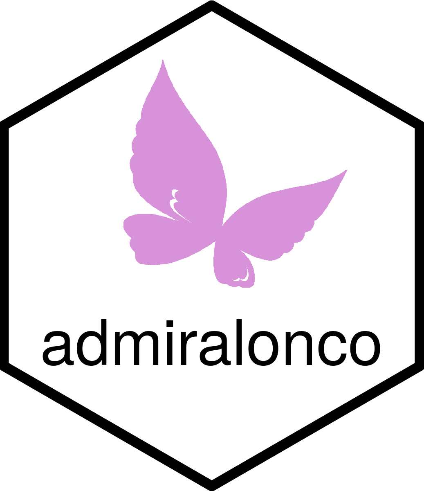

```{r setup, include=FALSE}
knitr::opts_chunk$set(echo = TRUE)
link <- function(text, url) {
  return(
    paste0(
      "[", text, "]",
      "(", url, ")"
    )
  )
}
dyn_link <- function(text,
                     base_url,
                     relative_url = "",
                     # Change to TRUE when admiral adopts multiversion docs
                     is_multiversion = TRUE,
                     multiversion_default_ref = "main") {
  url <- paste(base_url, relative_url, sep = "/")
  if (is_multiversion) {
    url <- paste(
      base_url,
      Sys.getenv("BRANCH_NAME", multiversion_default_ref),
      relative_url,
      sep = "/"
    )
  }
  return(link(text, url))
}
# Other variables
admiral_homepage <- "https://pharmaverse.github.io/admiral"
```

<!-- Please do not edit the README.md file as it is auto-generated after PR merges. Only edit the README.Rmd file -->
<!-- The purpose of this is to enable dynamic links using dyn_link function above to access devel/main admiral homepage respectively -->
<!-- To test this in your feature branch use code: rmarkdown::render("README.Rmd", output_format ="md_document") -->

# admiralonco 

<!-- badges: start -->
[](https://pharmaverse.org)
[](https://CRAN.R-project.org/package=admiralonco)
[](https://github.com/pharmaverse/admiralonco/actions/workflows/code-coverage.yml)
<!-- badges: end -->

Oncology extension package for ADaM in R Asset Library `{admiral}`

## Purpose

To provide a complementary (to `{admiral}`) toolbox that enables users to develop oncology disease area specifics.

## Installation

The package is available from CRAN and can be installed by running `install.packages("admiralonco")`.

To install the latest development version of the package directly from GitHub use the following code:

```r
if (!requireNamespace("remotes", quietly = TRUE)) {
  install.packages("remotes")
}

remotes::install_github("pharmaverse/admiraldev", ref = "devel") # This is a required dependency of {admiralonco}
remotes::install_github("pharmaverse/admiral", ref = "devel") # This is a required dependency of {admiralonco}
remotes::install_github("pharmaverse/admiralonco", ref = "devel")
```

### Dependencies

The latest version of the package works with the latest versions of the packages
stated in `DESCRIPTION`.

If a previous version of the package should be used, it is recommended to use
latest version of the dependencies at the point of time when the previous
version of {admiralonco} was released. For example, admiralonco 0.3.0 was
released on 2023-03-14. I.e., it will work with the latest version of packages
available at that date, e.g., admiral 0.10.

## Scope

* Build a toolbox of re-usable functions and utilities to create oncology-specific ADaM datasets in R in a modular manner.
* All functions are created based upon the ADaM Implementation Guide and aim to facilitate the programming of ADaM dataset standards.
* Initially the package will focus on the most common efficacy endpoint needs for solid tumor (using RECIST v1.1 response criteria),
but over time we will look to add extra areas such as: endpoints for targeted indications, baseline disease characteristics, common
sensitivity analyses and questionnaires.

## Expectations

`{admiralonco}` is expected to complement `{admiral}` and provide functions to help with the creation of the efficacy endpoints required for oncology ADaMs.

## References and Documentation

* Please refer to the `r dyn_link("{admiral} References and Documentation", admiral_homepage, "index.html#references-and-documentation")`

## R Versions

Here's a summary of our strategy for this package related to R versions:

* R versions for developers and users will follow the same as `{admiral}` core package.
* For development the `devel` branch of `{admiral}` core is used as a dependency. For releasing a new `{admiralonco}` version it must run using the latest released `{admiral}` core version, i.e., `main` branch of `{admiral}` core.

## Contact

We use the following for support and communications between user and developer community:

* [Slack](https://app.slack.com/client/T028PB489D3/C02M8KN8269) - for informal discussions, Q&A and building our user community. If you don't have access, use this [link](https://join.slack.com/t/pharmaverse/shared_invite/zt-yv5atkr4-Np2ytJ6W_QKz_4Olo7Jo9A) to join the pharmaverse Slack workspace
* [GitHub Issues](https://github.com/pharmaverse/admiralonco/issues) - for direct feedback, enhancement requests or raising bugs
